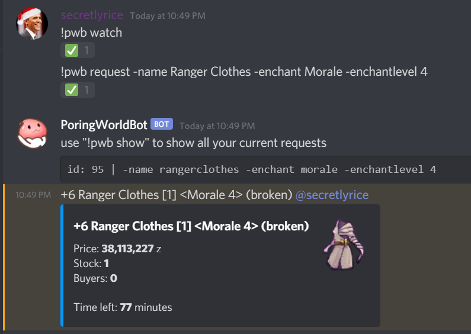

# PoringWorldBot
This is a snappening bot that queries the first 60 popular snaps from poring.world every six minutes and notifies an item to any subscribed request a user makes. Disclaimer: I am not the developer of poring.world. You can contact me on discord by [joining my server here](https://discord.gg/Rsq8Vpn).

## Invite link
You can use [this invite link](https://discordapp.com/oauth2/authorize?client_id=597932863597576204&scope=bot&permissions=2147634368) to add the bot I host to your server. My bot is hosted from my Raspberry Pi in my apartment so I make no guarantees on its uptime because my Spectrum internet likes to crap out.

## Permissions
- **View Audit Log**: This is a *required* permission. The bot runs on an internal permission level system. The bot uses the audit log to find the user who added this bot and makes them moderator so they can tell the bot to listen in a channel. 
- **Read Messages**: This is a *required* permission.
- **Send Messages**: This is a *required* permission.
- **Embed Links**: This is *highly recommended*. Without this permission, you won't be able to see the stock, buyers, and time left.
- **Mention @everyone, @here, and All Roles**: This is not required. However if you give this permission to the bot, then moderators can assign requests to roles so the bot can ping roles.
- **Add Reactions**: I dunno if this is required lol.

## Quick and easy instructions


1. Use the invite link provided previously to add the bot to your server. Be sure to check the boxes for all the required permissions.
2. Create a new channel. A few requests can create a lot of spam throughout the day that you probably don't want in your main channels.
3. Allow the bot to act in that channel. Right click the new channel -> Edit Channel -> Permissions -> Roles/Members + -> PoringWorldBot
4. Say `!pwb watch` in that channel and the bot will start listening to requests in that channel.
5. Consult [this wiki page](https://github.com/theBowja/PoringWorldBot/wiki/Parameters-for-adding-a-request) for help on constructing a request.
6. Consult [this wiki page](https://github.com/theBowja/PoringWorldBot/wiki/Command-reference) for detailed commands and usage.


==============================================================

The following instructions are for myself and should not be relevant to you because they're TODOs zzz.

better-sqlite3 requires python installation
# raspberry pi
updating from github
```
git fetch --all
git reset --hard origin/master
```
starting the bot
```
nohup node bot.js > poring.log 2>&1 &
tail -f poring.out
```
Use the 'exit' command when exiting out of ssh. If you just close out your command line, it might kill your application.

deleting the process
```
ps -ef | grep "node bot.js"
kill -9 [pid]
```
where pid is what you got from ps

